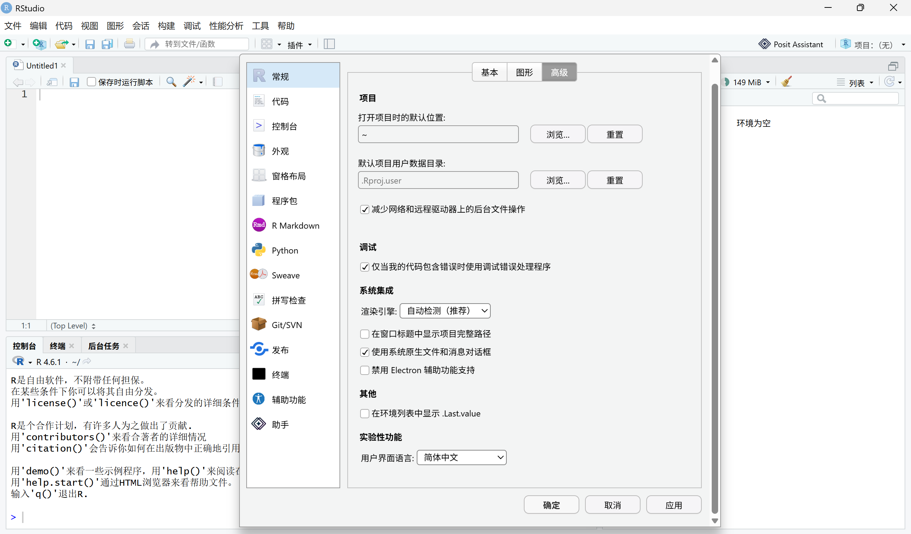

# RStudio 简体中文本地化

这是一个面向 Windows 用户的非官方 **RStudio Desktop 简体中文本地化项目**，也是由社区维护的 RStudio 中文版 / RStudio 汉化项目，主要面向希望使用简体中文界面的 R 初学者、学生、教师和科研用户。

项目使用 RStudio 自身的 GWT / Electron 国际化机制实现简体中文界面，而不是在运行时扫描或直接替换打包后的英文文本。代码、函数名、产品名称以及部分技术内容仍会保留英文，以尽量保持与原版 RStudio 和英文技术资料的一致性。

当前严格适配 Windows 版 `RStudio Desktop 2026.08.1+195`，对应上游提交 `8d474bc4cfad0e317095cd171e8ef44db6887068`。

本项目由社区维护，与 Posit 无隶属关系，也未获得 Posit 官方授权或认可，不代表 RStudio 官方中文版。



## 下载

[下载 RStudio 简体中文本地化 2026.08.1+195 RC1](https://github.com/SVC1996-code/rstudio-zh-cn/releases/tag/v2026.08.1%2B195-zh-cn-rc1)

当前公开版本为 `2026.08.1+195 RC1`，属于 GitHub **Pre-release**。该版本严格适配 RStudio Desktop `2026.08.1+195`，请勿用于其他版本。

Release 不包含完整 RStudio。安装前需要自行准备未经修改的对应版本官方 RStudio。

## 快速使用

从 [RC1 Release 页面](https://github.com/SVC1996-code/rstudio-zh-cn/releases/tag/v2026.08.1%2B195-zh-cn-rc1) 下载并完整解压：

`rstudio-zh-cn-2026.08.1+195-rc1-patch.zip`

然后在 PowerShell 7 中运行：

```powershell
pwsh -NoProfile -File .\Install-RStudioZhCn.ps1 `
  -SourcePath "C:\Program Files\RStudio" `
  -DestinationPath "$env:LOCALAPPDATA\Programs\RStudio-2026.08.1+195-zh-cn-rc1"
```

安装器会验证官方 RStudio 的版本和关键文件，并基于官方原版创建一个独立的中文版目录，**不会覆盖或修改原版 RStudio**。

普通用户不需要准备源码仓库、upstream source tree 或 GWT / Electron 构建工具。详细安装步骤、语言切换和卸载方式见[安装说明](docs/installation.md)。

## 当前状态

* 当前项目支持 RStudio Desktop `2026.08.1+195`。这是 RStudio 2026.08.1 正式发布版本中的一个构建，项目严格锁定该版本及对应上游提交，不保证兼容其他版本。
* RC1 已作为 GitHub Pre-release 发布，并已完成最终 Release ZIP 的独立安装验证。
* RC1 已完成核心运行冒烟测试（smoke test），核心界面和主要功能暂未发现由汉化造成的故障。
* GitHub Actions repository validation 已通过，本地发布门禁为 12/12 PASS。
* 运行验收不等于逐条语言审核，本项目不宣称所有翻译均已完成人工审核。

翻译资源当前记录为：

* `translated: 6016`
* `needs-review: 288`
* `reviewed: 0`
* `missing: 0`
* `buildReady: true`
* `releaseReady: false`

其中，`reviewed=0` 表示目前还没有通过 `review-decisions.json` 为单条翻译建立逐条、可追溯的正式人工审核记录；它并不表示 RC1 完全没有经过人工查看、实际使用或运行验收。

`buildReady: true` 表示当前资源满足构建条件，但这并不改变当前 `releaseReady: false` 的状态。当前 RC1 仍属于预发布版本。

## 实现方式

本项目采用 RStudio 官方 locale 架构进行本地化：

* GWT 界面文本使用 `*_zh_CN.properties`。
* Electron 界面文本使用 `zh-CN.json`。
* 少量尚未接入 i18n 的硬编码界面文本通过 `source-patches.json` 精确登记并接入本地化资源。
* 在锁定的上游源码上应用这些资源后，重新构建需要的 GWT 和 Electron 前端资源。

`rstudio.exe`、`rsession` 及其他原生程序不会被重新编译或修改。

本仓库也不包含完整 RStudio、完整上游源码、构建缓存或本机候选目录。

## 版本与安全边界

本项目采用严格版本锁定，不尝试对未知 RStudio 版本进行通用补丁。

* 只接受 `version.json` 登记的上游版本、提交和文件结构。
* 同步源码、工具下载、官方原版和补丁文件均进行版本或 SHA-256 校验；不匹配时拒绝继续。
* 安装器从已验证的官方原版创建新的独立目录，不覆盖官方原版。
* 文件写入、复制和移动操作必须位于配置的安全根目录内。
* 产品名、代码标识符、函数名、路径、外部网页以及尚未接入 i18n 的后端内容会有意保留英文。

严格版本锁定意味着：即使其他版本的 RStudio 看起来结构相似，也不代表可以直接套用本项目的补丁。版本或关键文件不匹配时，安装和构建流程应主动停止，而不是尝试继续修改未知版本。

## 从源码构建

公开构建和 CI 基线为 Windows 与 PowerShell 7。

示例：

```powershell
.\src\Bootstrap-BuildTools.ps1 -WorkspaceRoot 'E:\rstudio-zh-workspace'
.\src\Sync-RStudioSource.ps1 -WorkspaceRoot 'E:\rstudio-zh-workspace'
.\src\Build-RStudioZhCn.ps1 -WorkspaceRoot 'E:\rstudio-zh-workspace'
.\tests\Test-Repository.ps1 -WorkspaceRoot 'E:\rstudio-zh-workspace'
```

这些脚本会取得并验证锁定的上游源码与工具链，只重新构建本地化所需的 GWT / Electron 前端资源。

安装候选、运行验收以及更加完整的构建流程见下方文档。

## 路径配置

默认配置使用 `D:\R` 作为 workspace 根目录。该值只代表默认开发布局，并非强制要求。

所有主要脚本都可以通过 `-WorkspaceRoot` 使用其他目录，例如：

```powershell
.\src\Build-RStudioZhCn.ps1 -WorkspaceRoot 'E:\rstudio-zh-workspace'
```

也可以通过环境变量设置 workspace：

```powershell
$env:RSTUDIO_ZH_CN_WORKSPACE = 'E:\rstudio-zh-workspace'
```

如需分别配置 tools、upstream、RStudio 等安全根，可以复制：

`config/paths.psd1`

为被 Git 忽略的：

`config/paths.local.psd1`

并在其中设置 `Roots`。

显式路径参数仍必须位于对应的安全根目录内。

## 文档

* [架构说明](docs/architecture.md)
* [构建说明](docs/build.md)
* [安装说明](docs/installation.md)
* [测试说明](docs/testing.md)
* [翻译维护说明](docs/translation-guide.md)

如果只是下载安装中文版，优先阅读[安装说明](docs/installation.md)。

如果希望了解本项目如何接入 RStudio 官方国际化机制、如何重新构建前端资源或如何维护翻译，则可以继续阅读架构、构建和翻译维护文档。

## 许可与商标

本项目按 `AGPL-3.0-only` 维护。

上游来源、修改边界和许可证详情见：

* [LICENSE](LICENSE)
* [NOTICE](NOTICE)
* [SOURCE](SOURCE)
* [UPSTREAM.md](UPSTREAM.md)
* [`licenses/`](licenses/)

RStudio、Posit 及相关名称、商标和标识属于其各自权利人。

本项目为社区维护的非官方项目，与 Posit 无隶属关系，也未获得 Posit 官方授权、认可或背书。
